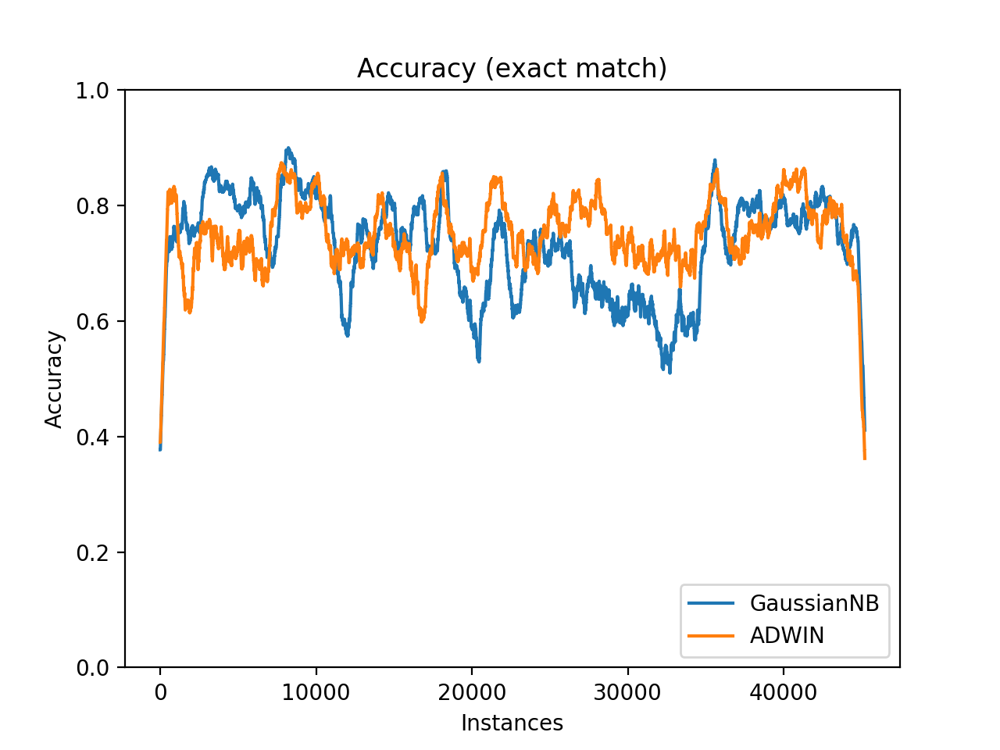

## AdWin:  ADaptive sliding WINdow algorithm

Based on paper: 

*Bifet and R. Gavalda. 2007. Learning from Time-Changing Data with Adaptive Windowing*

```python
class concept_drift.adwin.AdWin(
    delta=0.002, max_buckets=5, min_clock=32, min_win_len=10, min_sub_win_len=5
)
```

| Parameters | |
| ------------- | ------------- |
| delta |Confidence value |
| max_buckets | Max number of buckets within one bucket row |
| min_clock | Min number of new data for starting to reduce window and detect change |
| min\_window\_len | Min window length for starting to reduce window and detect change |
| min\_sub\_window\_len | Min sub-window length, which is split from whole window |

**Methods**

```python
set_input(value)
```
> Set input value to the drift detector - ADWIN.

|Type| Input - Output |
|---|----|
| Parameters | **value**: Input value |
| Return | Boolean: Whether has drift  |

**Example**

```python
from concept_drift.adwin import AdWin

adwin = AdWin()
for i in range(1000):
    if adwin.set_input(i):
        print("Here is a drift")
```

## Page-Hinckley Test
Based on Chapter 5.1: 

*Gama, J., Sebastião, R., & Rodrigues, P. P. (2013). On evaluating stream learning algorithms*

```python
class concept_drift.page_hinkley.PageHinkley(
    delta_=0.005, lambda_=50, alpha_=1 - 0.0001
)
```

| Parameters | |
| ------------- | ------------- |
| delta\_ | Magnitude of changes that are allowed |
| lambda\_ | Difference threshold |
| alpha\_ | Adaption variable for lambda adjustment |

**Methods**

```python
set_input(value)
```
> Set input value to the drift detector - PageHinkley.

|Type| Input - Output |
|---|----|
| Parameters | **value**: Input value |
| Return | Boolean: Whether has drift  |

## Test
 Used the **elecNormNew** dataset;<br>
 Used **GaussianNB** as based classification;<br>
 Used **accuracy_score** as input date for change detector;<br>
 Used the **prequential** evaluation;

<p align="center">
  
</p>

```
GaussianNB:
Mean acc within the window 1000: 0.7289912189511405

Page-Hinkley:
Drift detection: 8
Mean acc within the window 1000: 0.7342849306584686

AdWin:
Drift detection: 139
Mean acc within the window 1000: 0.7496421003738032
```
